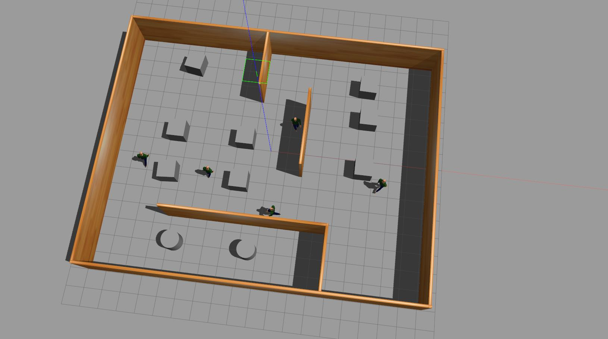
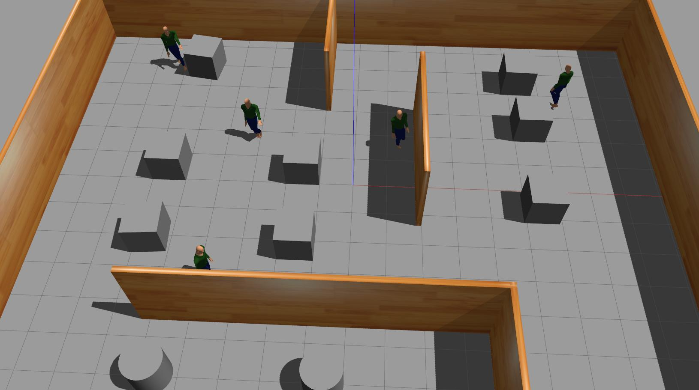

# ROS2_sfm_implementation

This repo is about how to transfer pedestrain plugin[1] in ROS2 humble. 

I am a beginner who just started to learn ROS. The video I learned about ROS2 comes from fishros.
(BiliBili 《ROS 2机器人开发从入门到实践》, Link -> https://space.bilibili.com/1940177928/lists/3565488?type=season).
Through this video, I learned about robot simulation with Gazebo. 
Next, when I tried to add a moving pedestrian to the Gazebo environment, the following problems occurred when using the original code from ![gazebo_sfm_plugin]{https://github.com/robotics-upo/gazebo_sfm_plugin}:
- Pedestrians are invisible sometimes
- Pedestrians pass through the model (through walls or other static obstacles)

And below is how to solve the problem. (The solution is helped by other technology enthusiasts, big thanks! And I want to share the solution)

I prepare a demo, and you can download and run it. And You can insert the moving pedestrain plugin in your own project.


## Implementation detail

Insert the following code into your .world file

```xml
<actor name="human_1">
	<pose>5 -2 1 0 0 1.57</pose>
	<skin>
		<filename>walk.dae</filename>
		<scale>1.0</scale>
	</skin>
	<animation name="walking">
		<filename>walk.dae</filename>
		<scale>1.0</scale>
		<interpolate_x>true</interpolate_x>
	</animation>
	<plugin filename="libPedestrianSFMPlugin.so" name="human_1_plugin">
		<collision scale="0.01 0.001 0.001">LHipJoint_LeftUpLeg_collision</collision>
		<collision scale="8.0 8.0 1.0">LeftUpLeg_LeftLeg_collision</collision>
		<collision scale="10.0 10.0 1.5">LeftLeg_LeftFoot_collision</collision>
		<collision scale="4.0 4.0 1.5">LeftFoot_LeftToeBase_collision</collision>
		<collision scale="0.01 0.001 0.001">RHipJoint_RightUpLeg_collision</collision>
		<collision scale="8.0 8.0 1.0">RightUpLeg_RightLeg_collision</collision>
		<collision scale="10.0 10.0 1.5">RightLeg_RightFoot_collision</collision>
		<collision scale="4.0 4.0 1.5">RightFoot_RightToeBase_collision</collision>
		<collision scale="0.01 0.001 0.001">Spine_Spine1_collision</collision>
		<collision scale="0.01 0.001 0.001">Neck_Neck1_collision</collision>
		<collision scale="5.0 5.0 3.0">Neck1_Head_collision</collision>
		<collision scale="0.01 0.001 0.001">LeftShoulder_LeftArm_collision</collision>
		<collision scale="5.0 5.0 1.0">LeftArm_LeftForeArm_collision</collision>
		<collision scale="5.0 5.0 1.0">LeftForeArm_LeftHand_collision</collision>
		<collision scale="4.0 4.0 3.0">LeftFingerBase_LeftHandIndex1_collision</collision>
		<collision scale="0.01 0.001 0.001">RightShoulder_RightArm_collision</collision>
		<collision scale="5.0 5.0 1.0">RightArm_RightForeArm_collision</collision>
		<collision scale="5.0 5.0 1.0">RightForeArm_RightHand_collision</collision>
		<collision scale="4.0 4.0 3.0">RightFingerBase_RightHandIndex1_collision</collision>
		<collision pose="0.05 0 0 0 -0.2 0" scale="12.0 20.0 5.0">LowerBack_Spine_collision</collision>
		<velocity>0.9</velocity>
		<radius>0.4</radius>
		<cycle>True</cycle>
		<animation_factor>5.1</animation_factor>
		<people_distance>6.0</people_distance>
		<goal_weight>2.0</goal_weight>
		<obstacle_weight>80.0</obstacle_weight>
		<social_weight>15</social_weight>
		<group_gaze_weight>3.0</group_gaze_weight>
		<group_coh_weight>2.0</group_coh_weight>
		<group_rep_weight>1.0</group_rep_weight>
		<time_delay>5</time_delay>
		<ignore_obstacles>
			<model>ground_plane</model>
			<model>turtlebot3_waffle</model>
		</ignore_obstacles>
		<trajectory>
			<goalpoint>5 -2 1 0 0 0</goalpoint>
			<goalpoint>5 2 1 0 0 0</goalpoint>
		</trajectory>
	</plugin>
	<plugin filename="libPedestrianVisualPlugin.so" name="pedestrian_visual">
		<update_rate>5</update_rate>
	</plugin>
</actor>
```

Parameters settings for pedestrain:
- update_rate: Update frequency.
- pose: Initial position.
- velocity: Pedestrian walking speed.
- radius: Pedestrian expansion radius.
- time_delay: Delayed start time.
- cycle: If true, loop; vice verse.
- ignore: Ignore the following models during planning or collision detection.
- trajectory:
  - goal_point_1: should set the same as initial pose.
  - goal_point_2: The pedestrian will move to this position
  - goal_point_3: The pedestrian will move to this position
  - ...

## How to run?
1.Clone the repo.
```
git clone https://github.com/tyjcbzd/ROS2_sfm_implementation.git
```
2. Build plugin
```
colcon build (--packages-select gazebo_sfm_plugin)
```

3. Run it!
```
. install/setup.bash

ros2 launch gazebo_sfm_plugin gazebo_demo.launch.py
```


## Demo visualization






Reference:
[1] https://github.com/robotics-upo/gazebo_sfm_plugin
[2] https://github.com/ai-winter/ros_motion_planning
